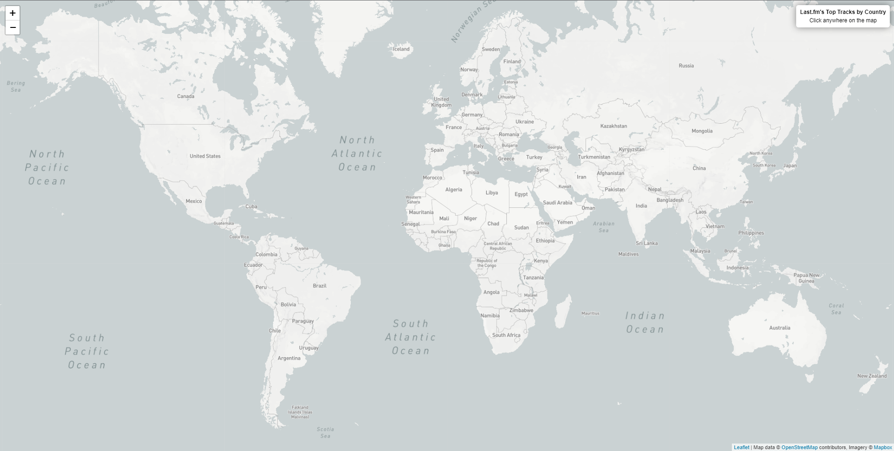
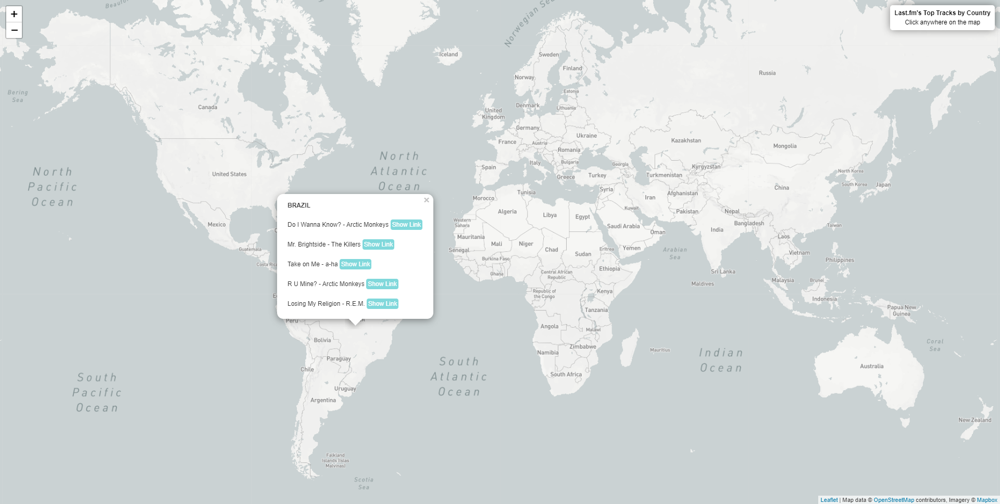
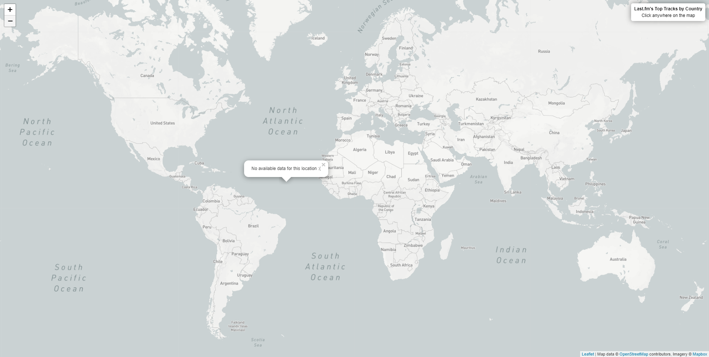
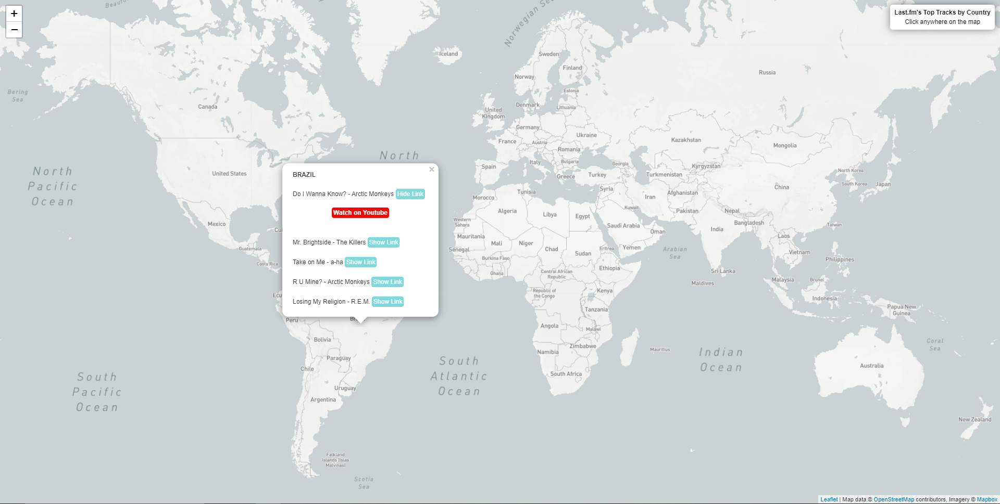

# webservices-trabalho-pratico-apis
Este projeto foi pensado para ser um webapp que integre dados de algumas API's de forma a mostrar um mapa que, ao ser clicado, mostre ao usuário uma pop-up, nas coordenadas do clique,
com as 5 músicas mais populares daquele país na plataforma "Last.fm" na última semana.

### API's Utilizadas
  - [Leaflet](https://leafletjs.com/reference.html) - gera o mapa e fornece ferramentas para manipulação das informações do mapa;
  - [Mapbox](https://docs.mapbox.com/api/overview/) - fornece o serviço de mapa e realiza a geocodificação reversa (gera informação de um local a partir de suas coordenadas);
  - [Last.fm](https://www.last.fm/api) - fornece várias informações sobre a plataforma "Last.fm", entre elas, as músicas mais tocadas por país;
  - [Youtube](https://developers.google.com/youtube/v3/docs/search/list) - fornece o link para um vídeo da música a partir de uma busca pelo título e artista.
  
## Instalação e uso
Para utilizar este projeto, basta descompactar o repositório em um diretório e acessar o arquivo `index.html`.
### Uso
As imagens abaixo mostram como a página se apresenta a partir de alguns eventos.
  
  - Mapa inicial
  
  
  
  - Mapa após clicar em uma localização válida
  
  
  
  - Mapa após clicar em uma localização inválida
  
  
  
  - Pop-up após clicar no botão "Show Link"  
  
  
  
